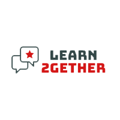

<p align="center">

</p>

# Learn2Gether Web Application

## About the project

Learn2Gether is not a regular ‘language learning app’. The application acts almost as a social media, connecting people
who would like to speak to each other, and try or learn new languages, without the pressure of having to learn said
language, all under the guise of a regular conversation. 

Admins will run in the background to regulate any complaints
from users, and oversee the entire operation, but the main idea is that the community drives the application forward.

### Features

* A forum, where users can post messages, and interact with each other. Comments are allowed.
* One on One Meetings, where a host will be able to host a patron on a live meeting.

### Main Tech Stack

* Laravel (PHP, Laravel-Nova)
* JetStream and Inertia (Vue.Js, TailwindCSS)
* MySQL 

Deployed with Laravel Forge.

## After Cloning Repository

On terminal, run:

```
$ npm install

$ composer install
```

Configure `.env` file to your needs.

On terminal, run:

```
$ php artisan migrate --seed

$ php artisan websockets:serve
```

## Acknowledgements

Final Project for 5th trimester of studies for Web Development at SAE Institute Belgrade.

William Nonato & SAE Institute Belgrade &copy; 2022.
